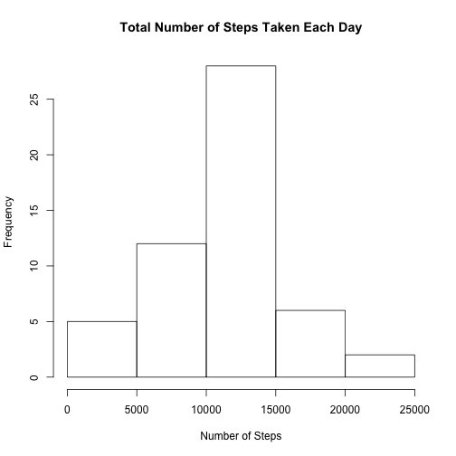
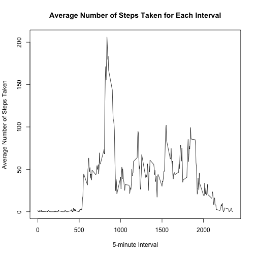
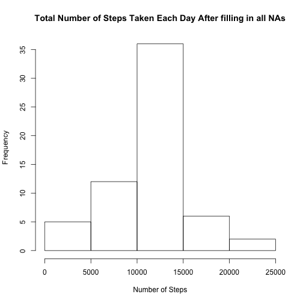

## Loading and preprocessing the data


```r
#1. Load the data

data <- read.csv("activity.csv")

#2. Convert the class of the date column from factor to Date.

data$date <- as.Date(data$date)
```

## What is mean total number of steps taken per day?

1. Total number of steps taken per day


```r
ts <- aggregate(steps~date,data,sum)
ts
```

```
##          date steps
## 1  2012-10-02   126
## 2  2012-10-03 11352
## 3  2012-10-04 12116
## 4  2012-10-05 13294
## 5  2012-10-06 15420
## 6  2012-10-07 11015
## 7  2012-10-09 12811
## 8  2012-10-10  9900
## 9  2012-10-11 10304
## 10 2012-10-12 17382
## 11 2012-10-13 12426
## 12 2012-10-14 15098
## 13 2012-10-15 10139
## 14 2012-10-16 15084
## 15 2012-10-17 13452
## 16 2012-10-18 10056
## 17 2012-10-19 11829
## 18 2012-10-20 10395
## 19 2012-10-21  8821
## 20 2012-10-22 13460
## 21 2012-10-23  8918
## 22 2012-10-24  8355
## 23 2012-10-25  2492
## 24 2012-10-26  6778
## 25 2012-10-27 10119
## 26 2012-10-28 11458
## 27 2012-10-29  5018
## 28 2012-10-30  9819
## 29 2012-10-31 15414
## 30 2012-11-02 10600
## 31 2012-11-03 10571
## 32 2012-11-05 10439
## 33 2012-11-06  8334
## 34 2012-11-07 12883
## 35 2012-11-08  3219
## 36 2012-11-11 12608
## 37 2012-11-12 10765
## 38 2012-11-13  7336
## 39 2012-11-15    41
## 40 2012-11-16  5441
## 41 2012-11-17 14339
## 42 2012-11-18 15110
## 43 2012-11-19  8841
## 44 2012-11-20  4472
## 45 2012-11-21 12787
## 46 2012-11-22 20427
## 47 2012-11-23 21194
## 48 2012-11-24 14478
## 49 2012-11-25 11834
## 50 2012-11-26 11162
## 51 2012-11-27 13646
## 52 2012-11-28 10183
## 53 2012-11-29  7047
```

2. Histogram of the total number of steps taken each day


```r
par(mar=c(5, 4, 4, 2) + 0.1)
hist(ts$steps,main="Total Number of Steps Taken Each Day",xlab="Number of Steps")
```

 

3. The mean and median of the total number of steps taken per day


```r
mean(ts$steps)
```

```
## [1] 10766.19
```

```r
median(ts$steps)
```

```
## [1] 10765
```


## What is the average daily activity pattern?


```r
as <- aggregate(steps~interval,data,mean)
plot(as$interval,as$steps,type="l",main="Average Number of Steps Taken for Each Interval",xlab="5-minute Interval",ylab="Average Number of Steps Taken")
```

 

```r
maxsteps <- as$interval[which(as$steps==max(as$steps))]
```
The No. 835 interval contains the maxium number of steps.

## Imputing missing values

The total number of missing values in the dataset is

```r
sum(is.na(data$steps))
```

```
## [1] 2304
```

Use the mean for the 5-minute interval to fill in all of the missing values


```r
newdata <- data
for (i in 1:nrow(newdata)) if(is.na(newdata$steps[i]))newdata$steps[i] <- as$steps[which(newdata$interval[i]==as$interval)]
```

Make a histogram of the total number of steps taken each day

```r
ts2 <- aggregate(steps~date,newdata,sum)
hist(ts2$steps,main="Total Number of Steps Taken Each Day After filling in all NAs",xlab="Number of Steps")
```

 

The mean and median total number of steps taken per day

```r
# The mean
mean(ts2$steps)
```

```
## [1] 10766.19
```

```r
# The median
median(ts2$steps)
```

```
## [1] 10766.19
```

The mean doesn't change becuase I filled in means for each 5-minute interval. However, the median changed a bit, from 10765 to 10766.19.

## Are there differences in activity patterns between weekdays and weekends?

```r
# Weekday or weekend
library(chron)
library(plyr)
newdata <- mutate(newdata,day=is.weekend(date))
for (i in 1:nrow(newdata)) if(newdata$day[i]) newdata$day[i] <- "weekend" else newdata$day[i] <- "weekday"
invisible(as.factor(newdata$day))

# Make a panel plot
library(lattice)
mstep <- aggregate(newdata$steps,by=list(newdata$interval,newdata$day),mean)
names(mstep) <- c("interval","day","steps")
xyplot(steps~interval | day, mstep,type="l",layout=c(1,2),xlab="Interval",ylab="Number of steps")
```

 

Activity patterns differ between weekdays and weekends. During weekends, people walk more in the whole day. However, during weekdays, people walk more in the morning.
